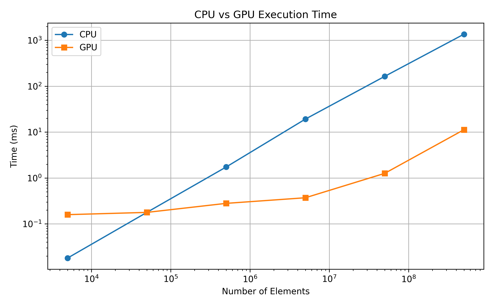

# Comparing GPU and CPU processing speeds on a parallel compute problem
In this week's lab we compared GPU to CPU in terms of their architecture and different use cases. 
## Introduction
GPUs were originally designed for graphics rendering, which involves processing thousands of polygons independently. GPUs excel at problems that are 'embarassingly parallel'.

- Why is the GPU better at parallelization?
## Experiment
- Specs of our GPU and CPU setup
- Why did we choose vector addition to compare performance?
## Results

For the CPU, the computation time grows exponentially with the array size, while the GPU exhibits roughly linear growth.
CPU and GPU take the same time for adding 50000 vector elements. For 10x more elements, we already observe a 6x speedup. The difference grows larger as the array length increases: For 500000000 elements, the GPU computes is over 120x faster than the CPU. 
For smaller arrays, the CPU actually outperforms the GPU. It is over eight times faster at adding 5000 elements.

## Conclusion
The GPU times scale very well for vector addition, as it is designed for computations that are highly parallelizable. This advantage is due to the higher aggregate memory bandwith and larger number of processing units of the GPU. The GPU, however also has some bottlenecks that lead to worse relative performance for smaller computations. The GPU kernel has to be launched from the CPU thread to prepare the computation, which may cost tens of milliseconds. Additionally, the input vectors initially live in the CPU RAM and have to be transferred to the GPU memory. For future one may further explore these bottleneck effects. How long do kernel launch and memory transfer each take exactly? 
